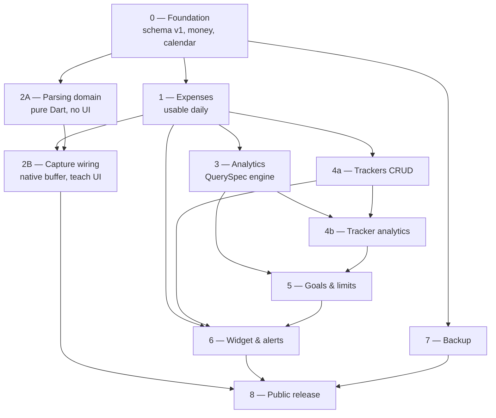

# NimbuStats — Phase Briefs

One self-contained brief per phase, so a fresh session can pick up any phase
without carrying the whole project in context — and so two phases can run in
parallel without stepping on each other.

**Spec:** `docs/superpowers/specs/2026-08-20-nimbustats-design.md`
**Shared rules every phase obeys:** [`CONVENTIONS.md`](CONVENTIONS.md)
**Blocked work carried forward:** [`DEFERRED.md`](DEFERRED.md)

---

## Starting a phase session

Open a fresh session and paste the kickoff prompt from the top of the phase's
brief. It is deliberately short:

```
Read docs/phases/CONVENTIONS.md and docs/phases/phase-3-analytics.md, then
execute Phase 3. Do not read the other phase briefs or plans.
```

The session then verifies its own prerequisites (`git tag --list
'phase-*-complete'`), expands the brief into a step-by-step TDD plan with
`superpowers:writing-plans`, and executes it.

**Why the brief stops short of full TDD steps.** Phase 0's plan is 2,750 lines
of exact code because it builds on nothing — every type in it is decidable
today. Phase 3's tests must assert against the DAOs and value types Phase 1
actually ships, which do not exist yet. Writing those steps now would be
fiction that the executor has to unlearn. So each brief fixes everything that
*is* decidable now — scope, schema delta, interfaces, traps, done criteria —
and the step-by-step plan is generated at kickoff against real code.

---

## Status board

Single source of truth. Update it in the commit that finishes a phase.

| Phase | Brief | Status | Gate tag |
|---|---|---|---|
| 0 — Foundation | [phase-0-foundation.md](phase-0-foundation.md) | **Complete** (2026-08-21) | `phase-0-complete` |
| 1 — Expenses | [phase-1-expenses.md](phase-1-expenses.md) | **Complete** (2026-09-27) — all 16 tasks shipped; the 4 hardware criteria measured on a Galaxy A53, with the fixes that run needed — [D1](DEFERRED.md#d1--android-build-unverified-google-maven-unreachable--resolved) | `phase-1-complete` |
| 2 — Capture | [phase-2-capture.md](phase-2-capture.md) | **2A complete** (2026-08-28) — parsing domain green, tagged `phase-2a-complete`; 2B not started and gated on Phase 1's tag | `phase-2-complete` |
| 3 — Analytics | [phase-3-analytics.md](phase-3-analytics.md) | **Engine complete** (2026-08-29); tasks 9–12 (breakdown, trends and period comparison, tag × category cross-tab, patterns and the necessity × satisfaction matrix) done 2026-09-07, on `main` since 2026-09-27; 13–14 (saved views, dashboard) done 2026-09-27 on `phase/3-saved-views`, awaiting the device check; 15 (performance pass) remains — builder deferred as [D10](DEFERRED.md#d10--no-saved-view-builder) | `phase-3-complete` |
| 4 — Trackers | [phase-4-trackers.md](phase-4-trackers.md) | Blocked on 1 | `phase-4-complete` |
| 5 — Goals & limits | [phase-5-goals.md](phase-5-goals.md) | Blocked on 3, 4 | `phase-5-complete` |
| 6 — Outside the app | [phase-6-outside-the-app.md](phase-6-outside-the-app.md) | Blocked on 1, 4, 5 | `phase-6-complete` |
| 7 — Backup | [phase-7-backup.md](phase-7-backup.md) | Ready — its AEAD/KDF need was quietly blocked by [D3](DEFERRED.md#d3--pubdev-archive-access-depends-on-the-vpn-exit-node--resolved) until 2026-09-05; candidate packages are now cached | `phase-7-complete` |
| 8 — Public release | [phase-8-public-release.md](phase-8-public-release.md) | Blocked on all | `phase-8-complete` |

---

## Dependency graph



---

## What can actually run in parallel

Being honest about this matters more than being optimistic — a "parallel" pair
that turns out to share files costs more than running them in sequence.

| Wave | Run together | Why it is safe |
|---|---|---|
| 0 | **0 alone** | Everything depends on it. No parallelism exists here. |
| 1 | **1** ∥ **2A** | 2A is `nimbus_domain/parsing/` — tokenizer, regex generator, dedup hashing. It needs only Phase 0's money and digit helpers, and shares no file with Phase 1's UI. |
| 2 | **2B** ∥ **3** ∥ **4a** ∥ **7** | Four disjoint directory sets. Three take a schema version (v10, v20, v30) — each takes the schema lock in turn, which is minutes apart, not days. |
| 3 | **5** ∥ **4b** | 5 needs the metrics from 3 and 4a; 4b is tracker charts on top of 3's engine. Different directories. |
| 4 | **6 alone** | Touches the widget, notifications, and every feature it surfaces. Not worth parallelising. |
| 5 | **8 alone** | Release work is serial by nature. |

**The realistic pairing for one operator is two at a time.** The machine is not
the bottleneck — review is. Each parallel branch needs its plan read, its
commits reviewed, and its merge resolved by the same person. Three concurrent
phases usually means three half-reviewed phases.

**The strongest pair is Wave 2's `3` ∥ `7`.** Analytics is the largest and most
intricate phase; backup is mechanically independent of it (encrypted dump of
the whole database file, so it does not care which tables exist). Neither one
blocks on the other at any point.

**The pair to avoid is `2B` ∥ `6`.** Both do Android-native work, both touch
build flavors and manifest permissions, and manifest merge conflicts are
tedious in a way Dart conflicts are not.

---

## If a phase reveals that a later brief is wrong

Expected, and fine. Update the later brief in the same commit as the discovery,
with a line in the commit body saying what changed and why. These briefs are
working documents; a stale brief that misleads a future session is worse than
one that is visibly edited.
